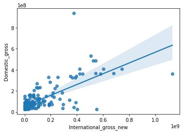

## Analysis of the Movie Gross revenue to give recommendation on a investiment plan
\
The goal of this project is to find out the types of movie that makes money in the Worldwide scale to benefit the movie investor for the future investment plans.

I use quest and BeautifulSOUP python package to scrape the data from https://www.boxofficemojo.com/.
I use sklearn, statsmodels, pandas and seaborn to run regression models and create plots. I attached a regression plot to show the relationship between Domestic gross revenue and International gross revenue

Conclusion: I found that the International gross revenue increase with Domestic gross revenue.

